<meta name="google-site-verification" content="MQbvGhpN1NHQFialBBxnta6hDtvF-9ZrCIR2vzzfnyI" />
 # Offline HomeLab Dashboard (MCP Integrated)

 [](https://opensource.org/licenses/MIT)
[](https://www.docker.com/)
[](https://www.keycloak.org/)
[](https://ollama.com/)
[](https://homarr.dev/)
[](https://caddyserver.com/)
[](https://github.com/The-Incredible-Gamma-Man/HomeLab_Dashboard_MCP_Integrated)


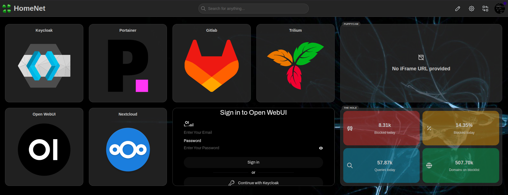
 
 ## Overview
 
 This homelab dashboard, built on **Homarr**, provides a centralized interface for managing your entire self-hosted ecosystem. It leverages **Caddy** to reverse-proxy all Docker containers across your subnet while enforcing HTTPS using self-signed certificates — all without requiring external internet access.
 
 The dashboard comes pre-configured with powerful tools including **Nextcloud**, **GitLab**, **Trilium**, **Portainer**, **Open WebUI**, and **Restreamer** for live video monitoring. Open WebUI integrates with **Ollama** for agentic AI capabilities through MCP (Model Context Protocol), enabling intelligent automation across your applications.
 
 For additional security and user management, **Keycloak** handles centralized authentication and group management via single sign-on. Eliminating the need for multiple account creations and complex password policies.
 
 **Best of all, it works completely offline.** Optional VPN integrations (ZeroTier, Tailscale) integrate easily for remote access if needed.
 
 Each application runs as an independent container with its own domain, allowing you to distribute apps across virtual machines or dedicated hardware appliances for granular resource control.
 
 ### Key Features
 
 - ✅ **Fully Airgapped** — Works in completely offline environments
 - 🤖 **Agentic AI** — Ollama-powered models handle tasks across your apps via MCP
 - 🔐 **Centralized SSO** — Keycloak manages all users and groups
 - 🔒 **HTTPS & Self-Signed Certs** — Secure by default
 - 🚪 **Limited External Facing Ports** — Everything runs internally on your LAN
 - 📦 **Portable & Modular** — Tested on Debian; easily distribute across hardware
 - 🎯 **Extremely Flexible** — Add, remove, or customize apps with minimal effort

 ---
 ## Getting Started

1. ```bash
   chmod +x launch_dashboard.sh
   ```
2. ```bash
   ./launch_dashboard.sh
   ```
7. Stick with default IP addresses, domains, ports and realm names until you know what you're doing.
8. Unless you set a password during install, it will be available in the `docker-compose.yml`.
9. Remember to regenerate your **Client Secret** in Keycloak, copy it and paste it into the highlighted `docker-compose.yml` variables (`# <---- Insert from Keycloak`).
10. Now navigate to the new `/Downloads/team-platform/` directory where you can begin configuring your ecosystem.

---

 ## Post Installation Guide
 
 ### Certificates!
 
 1. **Export Root CA Certificate**
    - If you intend on accessing the portal from another machine, you'll need to copy the `rootCA.crt` from `./certs` and install it on that device.
    - Wherever you host the `Caddyfile`, you'll need to point it at every app's `cert` and `key` `.pem` files.
    - When adding new apps to the environment, from the machine you launched the `launch_dashboard.sh` from, run:
      ```bash
      mkcert <new_app.lan> <new_app.lan> <new_app.lan>
      ```
      and transfer the 2 files to the `/certs` folder that Caddy is pointed at.
 
 4. **Understanding the Architecture**
    - All applications run on HTTP internally through Docker ports
    - Caddy handles HTTPS termination and exposes services on port 443
 
 
 ### Initial Config Steps
 
 1. Log into Keycloak using the `admin` password (found in `docker-compose.yml`) or as you remember setting during install.
    - If you have issue accessing Keycloak, edit the `docker-compose.yml`, removing any special characters from your admin password and run;
       - ```bash
         docker compose down keycloak && docker compose up -d keycloak
         ```
 2. Click **Create Realm** and if you do use the provided backup, import `realm-export.JSON` from the appropriate drive. 
 3. Navigate to **Realm Settings** → **Action** (top-right) → **Partial Import**
 4. If starting fresh, create a new realm with a dedicated admin user (do not use the default `Master` realm!).
 5. Create users and assign them to groups.
    - Ensure **Email Verified** is selected.
    - Add email, names and passwords for each user.
 6. If you did not use the `realm-export.JSON` backup file, you'll need to map your `groups` to the Realm roles;
    - Select `Client Scopes` from the left menu.
    - `Create Client Scope`
    - 'Name' = `groups` | 'Type' = `Default` | 'Display on consent screen' = `off` | 'Include in token scope' = `on` | `Save`
    - Select the `Mappers` tab → `Add mapper` → `From predefined mappers` | Select `realm roles`, `client roles`, `audience resolve`
    - Select `Add mapper` → `By configuration` → `Group Membership` | 'Name' = `groups` | 'Token Claim Name' = `groups` | 'Full group path' = `off` | `Save`
 
 ### Adding a New Website to the LAN
 
 #### Client (aka. Application) Configuration
 
 1. Create a client with **Client Authentication** enabled. If you used the `realm-export.json`, you will already have the clients generated.
 2. **Authentication Flow**: Enable **Standard Flow** (some apps require **Direct Access** - check official docs).
 3. **PKCE Method**: Leave unselected unless documentation specifies S256 (SHA256).
 4. **URLs**:
    - Root, Home, and Post-Logout URLs: `https://<app>.lan`
    - Valid Redirect URIs: `https://<app>.lan/*` or `https://<app.lan>/oauth/oidc/callback` (check the official docs for the app).
 5. **Credentials Tab**: Regenerate and copy the client secret into your `docker-compose.yml`
 6. **Client Scopes Tab**:
    - Select the hyperlinked `xxx-dedicated` scope.
    - Add: `username`, `email`, `groups` from the **Add Predefined Mappers** list.
    - Create the `groups` scope if it doesn't exist via the **Configure New Mapper** options;
       - Select **Group Membership**
       - Name = `groups`
       - Token Claim Name = `groups`
       - Full group path = `off`
       - Save
  7. Now for each client (application), copy the `credential secret` and paste it into the appropriate `docker-compose.yml` file environment variable if required.
  8. Similarly, within the appropriate `docker-compose.yml` file, you may need to input your `realm-name` where specified.
  9. Run;
     ```bash
     docker compose down && docker compose up -d
     ```
      
 ## Application-Specific Setup
 
 ### Open WebUI
 
 1. **Backup Files**
    - `models-xxx.json` → Upload to **Admin Settings** → **Models**
    - `openwebui-configxxx.json` → Upload to **Admin Settings** → **Database**
 
 2. **Admin Settings Configuration**
    - Enable **New Sign-ups**
    - Enable **API** and set permissions for integrations and models.
    - Recommended models for 24GB+ GPU minimum: `qwen3-coder:30B` or `qwen3.5:9b` (4-bit quantization minimum).
 
 3. **Pull Additional Models**
    ```bash
    docker exec ai-ollama ollama pull <model>
    ```
 
 ### Nextcloud
 
 1. Create a local admin user.
 2. Install the **OpenID Connect Backend** application.
 3. Navigate to **OpenID Connect** and register Keycloak with these settings:
    - **Discovery Endpoint**: `https://keycloak.lan/realms/YOUR_REALM_NAME/.well-known/openid-configuration`
    - **Backchannel Logout URL**: `https://nextcloud.lan`
    - **Redirect URI**: `https://nextcloud.lan`
    - **Client Secret**: From Keycloak Credentials
    - **Provider**: `Keycloak`
    - **Client ID**: Must match Keycloak exactly
    - **Scope**: `openid` `email` `profile`
    - **Extra claims**: `preferred_username` `email` `name` `groups`
 
 ### Homarr
 
 > **Important**: Some apps require an initial local admin user.
 
 1. Create a local admin user with a unique username
 2. Create a Homarr admin group that you will also apply to Keycloak (e.g., `homarr-admins`)
 3. Add your local user to this group in the app.
 4. Add the `./certs/rootCA` cert to **Management** → **Tools** → **Certificates**
 5. Be aware that new users will automatically be loaded to a default `everyone` group and permissions are required to be afforded to new boards and integrations.

 ### Restreamer to Homarr

 - Homarr relies on video.js as it doesn't understand native protocols, such as RTSP
 - An encoder is required, such as 'Restreamer' to convert from H.264 to HLS or FLV over HTTP
 - As Docker will need direct access to the attached camera through the hardware, it's counterintuitive to generate a docker-compose file for Restreamer when the camera could be on any machine on the LAN.
   Instead, you'll find 2 commands below to spool up Restreamer. One for ephemeral use and one for storing data. If you're running offline, the datarhei images will need to be pre-pulled;
   
   - Temporary:
   ```bash
   docker run --rm -d -p <ext_ip_add:port for Caddy to connect to>:8080 --device /dev/<cam location>:/dev/video -e "RS_MODE=USBCAM" -e "RS_USBCAM_VIDEODEVICE=/dev/video" --tmpfs /tmp/hls datarhei/restreamer
   ```
   
   - Permanent:
   ```bash
   docker run -d -p <ext_ip_add:port for Caddy to connect to>:8080 --device /dev/<cam location>:/dev/video -e RS_HTTPS=true -e "RS_MODE=USBCAM" -e "RS_USBCAM_VIDEODEVICE=/dev/video" --tmpfs /tmp/hls -v           /mnt/restreamer/db:/core/config -v /opt/restreamer/data:/core/data datarhei/restreamer`
   ```

 - Paste to the 'video streaming' item in Homarr's dashboard -> http://<ip:port>/memfs/<docker-id>.m3u8 | also found on Restreamer, under the cam channel, marked `HLS`
 - If the above fails, use an 'iframe' item in Homarr and paste the HTML link | found on Restreamer, inside the `Player` config options. NOT the iFrame link! Homarr manages that for you.
 - See example config:
   
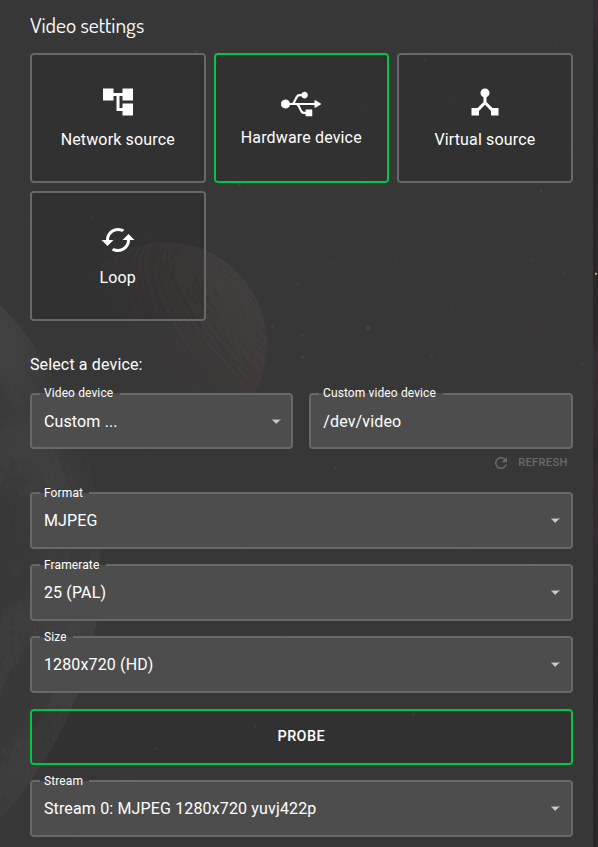

 ---
 
 ## Considerations
 
 1. **Caddyfile**: Add client configuration with the matching exposed port from `docker-compose.yml`. (ie. `...ports: "8080:80"` = ...ports: "expose_to_caddy:internal_docker")
 2. **Hosts File**: Update `/etc/hosts`. In most cases, every domain needs to point to the Caddy IP. Caddy is the only machine that needs to know who-is-who.
 5. **HTTPS**: Never enable in-app HTTPS or certificate use as this is all managed through Caddy.
 6. **User Auto-Population**: Groups and user details populate automatically on first sign-in. No need to create new users in apps, aside from an initial local admin.
 
 ## Docker Commands
 
 | Command | Purpose |
 |---------|---------|
 | `docker ps` | Check status of running containers |
 | `docker exec ai-ollama ollama list` | List Ollama models |
 | `docker compose -p team-platform logs -f <service>` | Follow service logs |
 | `docker compose -p team-platform down <service>` | Stop service(s) |
 | `docker compose -p team-platform up -d <service>` | Start service(s) |
 
 > **Note**: Run compose commands from the directory containing `docker-compose.yml`. Omit `<service>` to affect all services.
 
 ## Ollama Model Management
 
 ```bash
 # Pull a model
 docker compose -p team-platform exec ollama ollama pull <model:quantization>
 
 # List available models
 docker compose -p team-platform exec ollama ollama list
 
 # Delete a model
 docker compose -p team-platform exec ollama ollama rm <model>
 ```
 
 ---
 
 **⚠️ Notes**
 - Each `docker-compose.yml` environment is unique—refer to official application documentation for specific configurations
 - This setup is still being tested; please report any issues or improvements
 - The bulk of the work is automated by the installation script!
 - If you choose to deploy an app on another machine, just copy the relevant `docker-compose.yml` segment for that app and create a new `docker-compose.yml` file on that machine and edit;
    - Any references to IP address in the environment variables.
    - Port exposure that Caddy reaches out to - if required in order to avoid clashes with other running services.
    - `/etc/hosts` should always point to the Caddy IP address, except the machine hosting Caddy - update this machine's `/etc/hosts` with the new IP.
    - Update the Caddyfile to reach out to the new host IP.
    - Remember to upload the rootCA.crt onto the new machine.
 - Don't neglect your firewall rules!
    ```bash
    sudo ufw default deny incoming && sudo ufw default allow outgoing && sudo ufw reload
    ```
    As a minimum.

   ---

**Project Gallery**

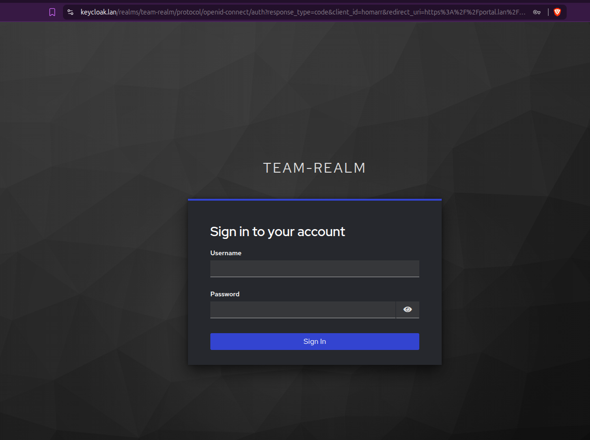

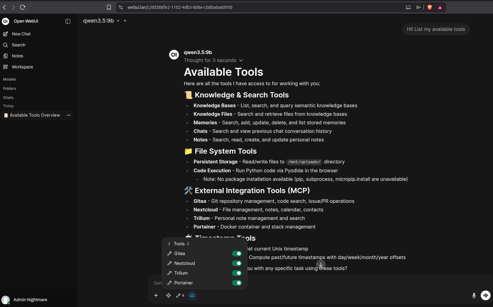

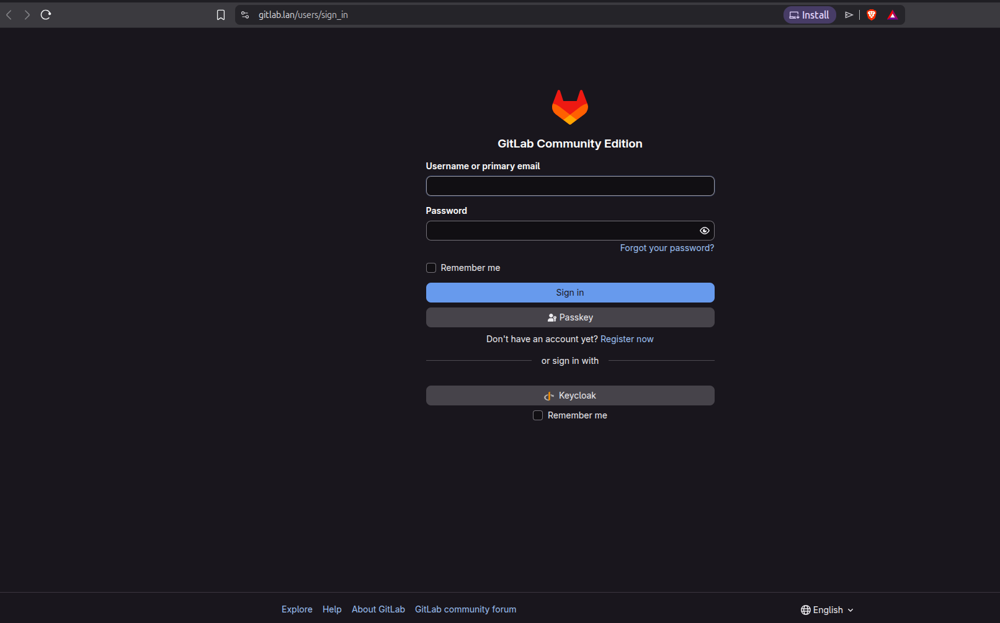

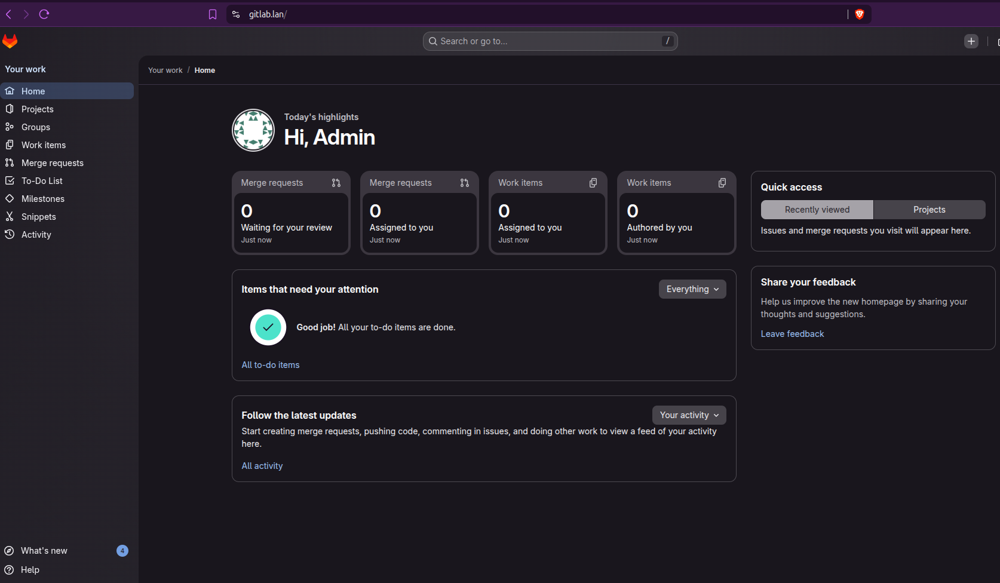

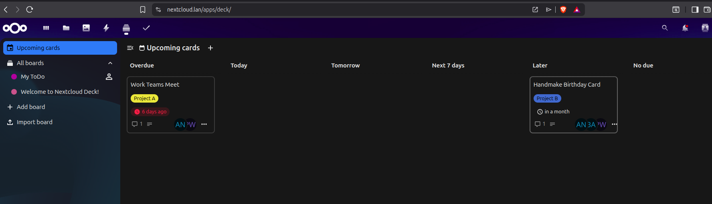

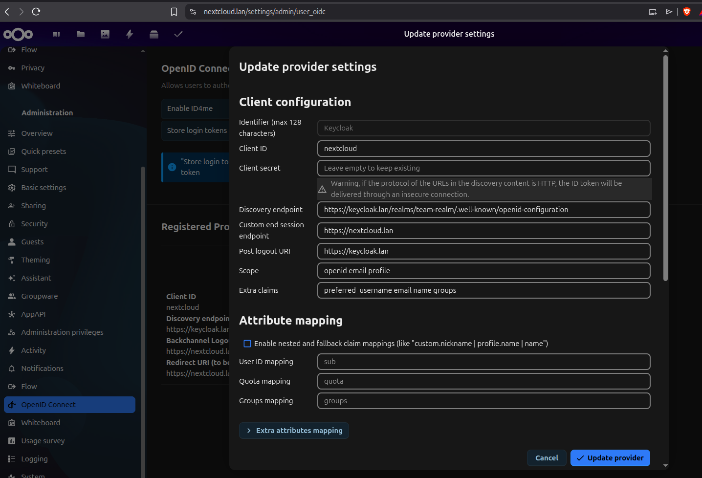


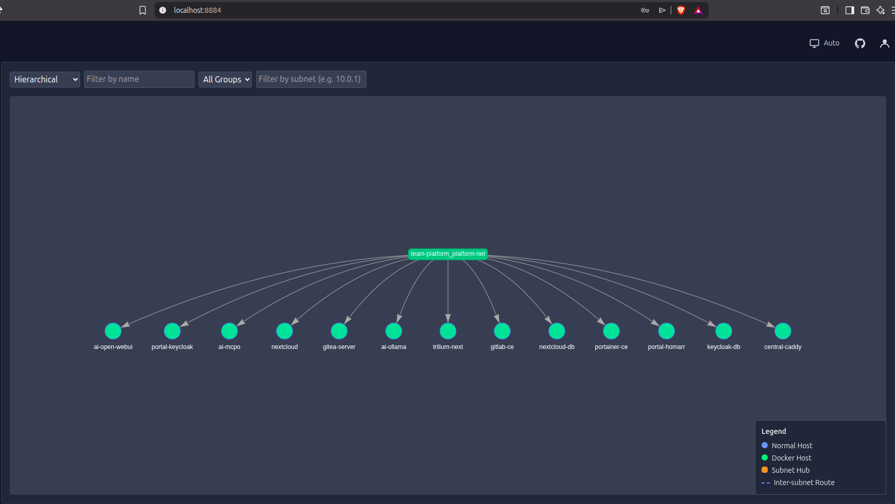

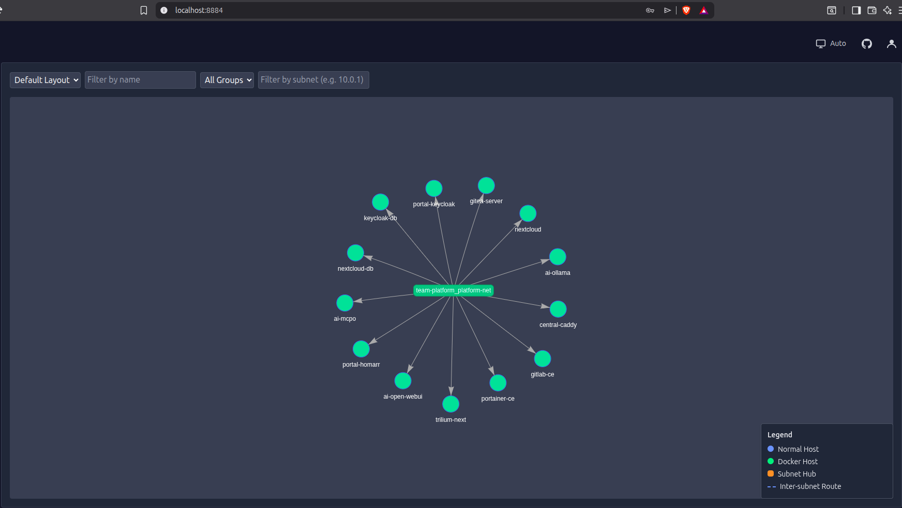

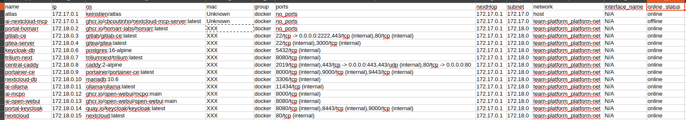
*ai-nextcloud-mcp shows as 'offline' until the config file has been populated with API keys from each app
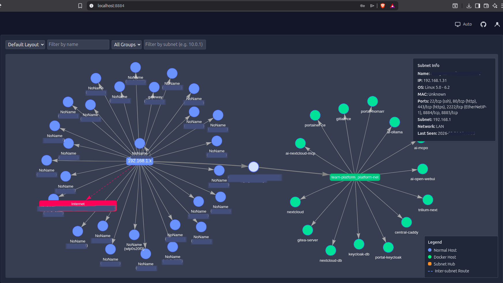

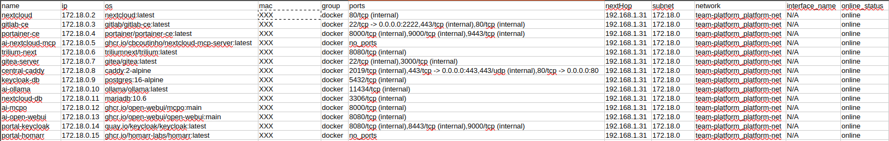

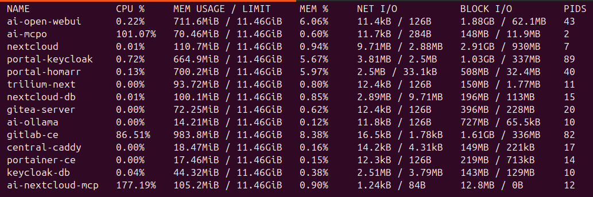
*Docker CPU percentage is relative to number of cores in use. 100% = 1 core

---

## License

This project is licensed under the [MIT License](LICENSE) - see the `LICENSE` file for full details.

### AI Disclaimer

Much of the content within the `launch_dashboard.sh` script was generated individually at different times with different hosts. Grok and Claude Sonnet were used to 
assist orchestrating these elements together into one file, particularly for handling complex kernel-level and permissions issues, while also improving the script's
runtime appearance and user experience.

Every line has been carefully reviewed, edited and tested by the main contributor to ensure safety and correctness. Nothing was left unchecked.
